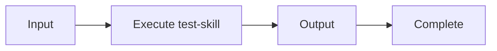

## Process

This skill calls /test-skill to do the actual work. Notice how the mermaid diagram below references test-skill by its ID - toolsview will highlight it with a green color to show it's a known skill in the graph.

## Features

- Demonstrates skill-to-skill references
- Mermaid nodes matching skill IDs are automatically highlighted
- Great for visualizing skill dependencies and workflows
