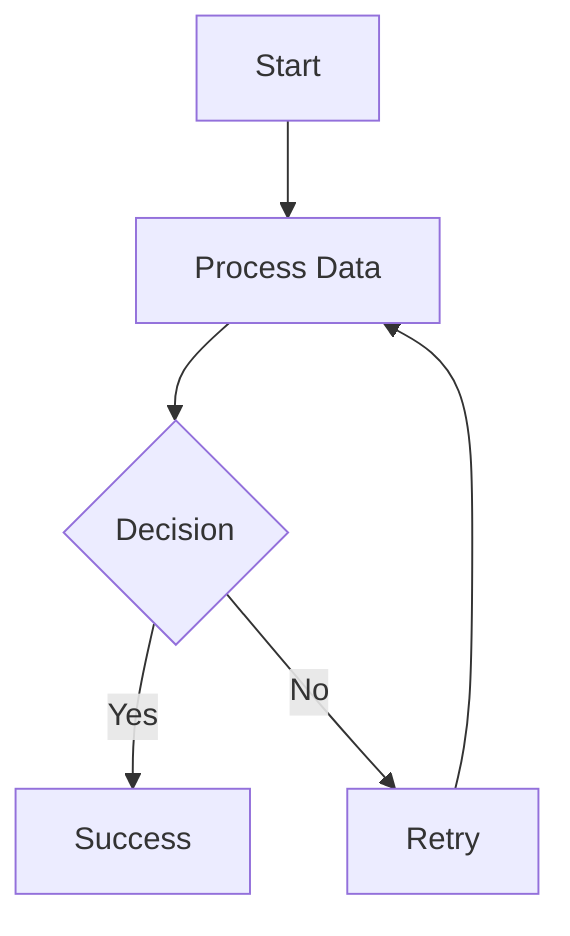

## Workflow

This skill demonstrates how to include mermaid diagrams in skill documentation. The diagram shows a typical decision flow.

## Steps

1. First, initialize the system
2. Then process the data
3. Finally, validate results
